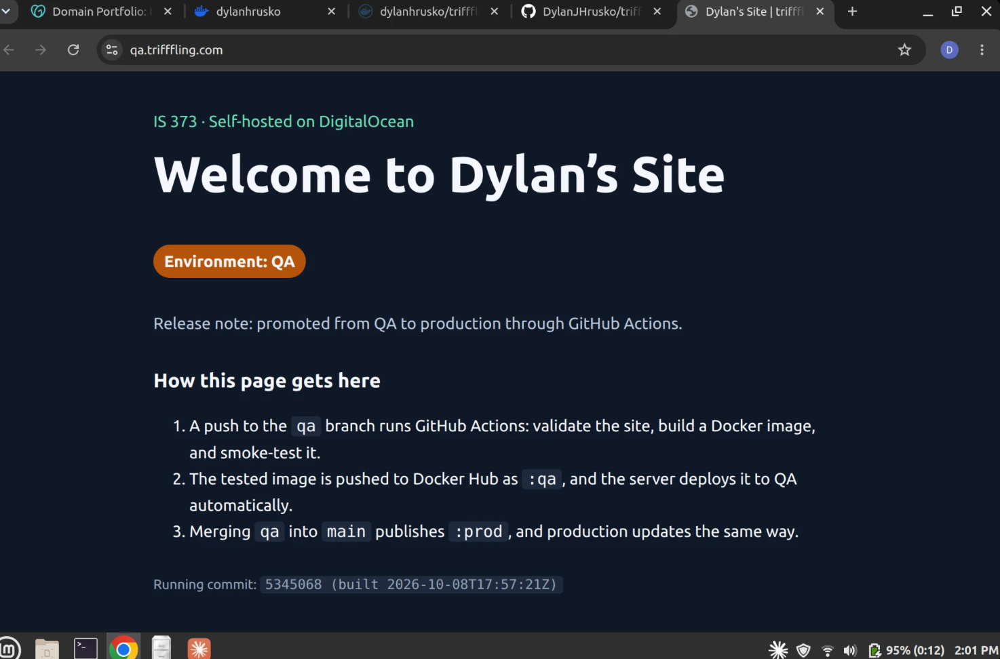
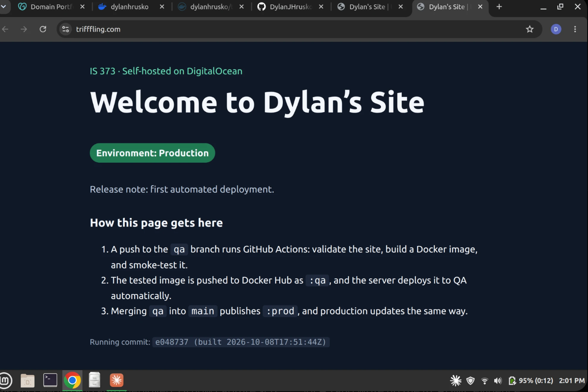
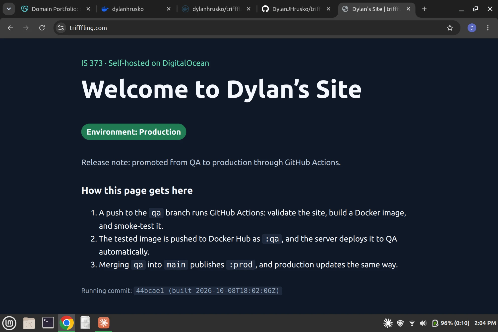

# Dylan's Site — trifffling.com

**Production:** https://trifffling.com
**QA:** https://qa.trifffling.com

A simple containerized website deployed to my own DigitalOcean Droplet with GitHub Actions. Both environments run behind Traefik with Let's Encrypt HTTPS.

## Promotion rule

| Branch | Deploys to | Image tag |
|---|---|---|
| `qa` | QA — https://qa.trifffling.com | `dylanhrusko/trifffling-site:qa` |
| `main` | Production — https://trifffling.com | `dylanhrusko/trifffling-site:prod` |

1. Push a change to the `qa` branch. It deploys to QA only; production is unchanged.
2. After checking QA, open a pull request from `qa` into `main`. The PR runs the same checks but never publishes or deploys.
3. Merging the PR into `main` promotes the change to production.

## How CI/CD works

**Trigger:** any push to `qa` or `main` (and pull requests into `main`, which only run the checks).

**Checks:** `tests/test_site.py` validates the page (title, owner heading, no inline scripts, referenced files exist, nginx hides its version, image runs as non-root). The workflow then builds the Docker image and smoke-tests the running container with a read-only filesystem and no Linux capabilities: it must serve the page, report the exact commit in `/version.json`, hide the nginx version, and not run as root. **Any failed check stops the job before anything is pushed or deployed.**

**Build:** the [`Dockerfile`](Dockerfile) copies the site into the official unprivileged nginx image (UID 101, port 8080) and writes the commit SHA into `/version.json`.

**Delivery:** the tested image is pushed to Docker Hub as `sha-<commit>` plus `:qa` or `:prod`, using the `DOCKER_API_KEY` GitHub Actions secret. On the server, [WUD](https://getwud.app) checks Docker Hub every minute and recreates only the container whose tag changed. The workflow's last step waits until the public site reports the new commit, so a green run means the change is live. GitHub holds no credentials for the server.

## Repository layout

| Path | Purpose |
|---|---|
| `site/` | Website source (HTML, CSS, JS) |
| `nginx/default.conf` | Web server config: security headers, hidden version |
| `Dockerfile` | Image build |
| `tests/test_site.py` | Validation run before every build |
| `.github/workflows/cicd.yml` | CI/CD workflow |
| `deploy/compose.yaml` | Server deployment: QA + production containers and the WUD updater, routed by Traefik |

Image registry: https://hub.docker.com/r/dylanhrusko/trifffling-site/tags

## Test Evidence

### QA → production demonstration (October 8, 2026)

The visible change: the page's release note went from "first automated deployment." to "promoted from QA to production through GitHub Actions."

| Step | Workflow run | Commit / image tag | Result |
|---|---|---|---|
| 1. Push to `qa` | [Run 37820388974](https://github.com/DylanJHrusko/trifffling-site/actions/runs/37820388974) | `5345068` → `dylanhrusko/trifffling-site:qa` | QA updated, production unchanged |
| 2. PR `qa` → `main` | [PR #1](https://github.com/DylanJHrusko/trifffling-site/pull/1) | checks only, no deploy | Merged |
| 3. Push to `main` (merge) | [Run 37821147839](https://github.com/DylanJHrusko/trifffling-site/actions/runs/37821147839) | `44bcae1` → `dylanhrusko/trifffling-site:prod` | Production updated |

Each run validated the site, built the image, smoke-tested the container, pushed to Docker Hub, and then waited until the public URL reported the new commit (see each run's summary). First deployments: [QA run 37819520163](https://github.com/DylanJHrusko/trifffling-site/actions/runs/37819520163), [production run 37819518189](https://github.com/DylanJHrusko/trifffling-site/actions/runs/37819518189).

**Image registry:** https://hub.docker.com/r/dylanhrusko/trifffling-site/tags (tags `qa`, `prod`, and `sha-<commit>` for every release).

**Deployed now:** production `44bcae155a385302bfc6e40473636368f095ed5a`, QA `5345068d837e2cc75611bb39340ac01ada18d8d0` — each site shows its running commit at the bottom of the page and at `/version.json`.

#### Screenshots

1. QA after the push to `qa` (new release note, QA badge):
   
2. Production at the same time, still on the old release note:
   
3. Production after merging `qa` into `main`:
   

### SSH security

Run from my laptop after hardening (`/etc/ssh/sshd_config.d/01-hardening.conf`, loaded before the cloud-init defaults). Key login as the non-root user works; root and password login are rejected. No keys, passwords, or tokens are shown.

```text
$ ssh dylanh@157.230.95.176   # key login as the new non-root user
logged in as: dylanh (uid 1000) on selfHost373

$ ssh root@157.230.95.176   # direct root login
root@157.230.95.176: Permission denied (publickey).

$ ssh -o PubkeyAuthentication=no -o PreferredAuthentications=password dylanh@157.230.95.176   # password login
dylanh@157.230.95.176: Permission denied (publickey).

$ sudo sshd -T | grep -E "permitrootlogin|passwordauthentication|kbdinteractive|pubkeyauthentication|authenticationmethods|allowusers"
permitrootlogin no
pubkeyauthentication yes
passwordauthentication no
kbdinteractiveauthentication no
allowusers dylanh
authenticationmethods publickey
```

Raw output: [docs/evidence/ssh-evidence.txt](docs/evidence/ssh-evidence.txt)

### Server hardening summary

- DigitalOcean Cloud Firewall and UFW allow inbound TCP 22, 80, and 443 only; SSH is rate-limited.
- SSH: key-only login as the non-root user `dylanh`; root login and password login disabled.
- Containers run as a non-root user with a read-only filesystem, no Linux capabilities, and `no-new-privileges`; only Traefik publishes ports.
- No server credentials exist in GitHub: the server pulls released images itself.
